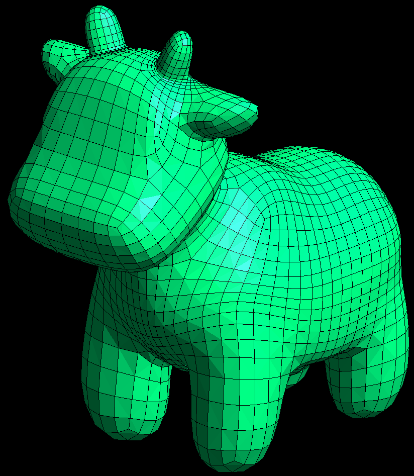

# Conforming Weighted Delaunay Triangulations

<!-- | Input surface mesh | Result surface mesh | Result tetrahedral mesh (shrink: 0.3)|
| --- | --- | --- |
|  |  | |

| Result tetrahedral mesh (in-out) | Result tetrahedral mesh (wireframe) | Result tetrahedral mesh (clipping) |
| --- | --- | --- |
|  |  |  | -->

<table>
<tr>
<th>Input surface mesh</th>
<th>Result surface mesh</th>	
<th>Result tetrahedral mesh<br>(shrink: 0.3)</th>
</tr>
<tr>
<td>  </td>
<td>  </td>
<td>  </td>
</tr>
<tr>
<th>Result tetrahedral mesh<br>(in-out)</th>
<th>Result tetrahedral mesh<br>(wireframe)</th>	
<th>Result tetrahedral mesh<br>(clipping)</th>
</tr>
<tr>
<td>  </td>
<td>  </td>
<td>  </td>
</tr>
</table>

This repo is a rearrangement of the code for the work "[**Conforming Weighted Delaunay Triangulations**](https://dl.acm.org/doi/abs/10.1145/3414685.3417776)" by [Marc Alexa](https://cg.tu-berlin.de/people/marc-alexa).
The original reference implementation can be found at [[source code]](https://cragl.cs.gmu.edu/iheartla/evaluation/static/cases_res/Conforming%20Weighted%20Delaunay%20Triangulations/cwdt3.cc).

If you use this code in your research, **please cite the original work**:

```
@article{10.1145/3414685.3417776,
	author = {Alexa, Marc},
	title = {Conforming weighted delaunay triangulations},
	year = {2020},
	issue_date = {December 2020},
	publisher = {Association for Computing Machinery},
	address = {New York, NY, USA},
	volume = {39},
	number = {6},
	issn = {0730-0301},
	url = {https://doi.org/10.1145/3414685.3417776},
	doi = {10.1145/3414685.3417776},
	journal = {ACM Trans. Graph.},
	month = nov,
	articleno = {248},
	numpages = {16},
	keywords = {simplicial meshes, conforming meshes}
}
```

# :bulb: What did I do?

- Improved code organization
- Enhanced readability
- Updated CMake build configurations
- Added command line applications

# :link: Requirements / dependencies

- [Eigen](https://eigen.tuxfamily.org/index.php?title=Main_Page) (version >= 3.4)
- [Boost](https://www.boost.org) (version >= 1.78.0)
- [CGAL](https://www.cgal.org/index.html) (version >= 5.6)
- [Gurobi](https://www.gurobi.com)
- [libigl](https://github.com/libigl/libigl)
- [CLI11](https://github.com/CLIUtils/CLI11?tab=readme-ov-file#install) (already included)

> [!NOTE]
> The gcc version needs to be compatible with the boost version. It seems that gcc 15.1 is not compatible with boost 1.87.0... :thinking:

# :checkered_flag: Getting started

```
git clone https://github.com/Canjia-Huang/CWDT.git
```

# :hammer: Build

```
mkdir build
cd build
cmake ..
make
```

# :computer: Usage

```
./CWDT [OPTIONS] input_surface_mesh_path
```

Options (use `--help` for more details):

```
OPTIONS:
  -h,     --help              Print this help message and exit 
          --ns INT            Maximum number of splits (default: 100). 
          --nr INT            Maximum number of rounds (default: 100). 
          --hf FLOAT          Height factor (default: 1.0). 
          --wf FLOAT          Weight factor (default: 1.0). 
          --tol FLOAT         Minimum tolerance (default: 1e-9). 
          --np                Not utilize the winding number to eliminate external tetrahedra 
                              (default: false). 
          --pthr FLOAT        Threshold during the peel operation (default: 0.5), where 
                              tetrahedra with a winding number of their centroids less than 
                              this thr are identified as external. 
          --shrink FLOAT      The shrink factor of each tetrahedron in the result used for 
                              visualization (default: 0.3). 

```

## Example

```
./CWDT ../data/spot_quadrangulated.obj
```

The following result files will be generated in the directory of the input surface mesh path upon successful execution:
- **result_surface_mesh.off** - the surface mesh of the input surface mesh in the resulting tetrahedral mesh
- **result_weighted_surface_mesh.off** - similar as "result_surface_mesh.off", each vertex contains a weight
- **result_tets.obj** - the file used for visualizating the resulting tetrahedral mesh
- **result_tets.mesh** - the resulting tetrahedral mesh (can be opened with [Gmsh](https://gmsh.info)), in which the tetrahedra inside have a label of "1", while the outside tetrahedra have a label of "2"